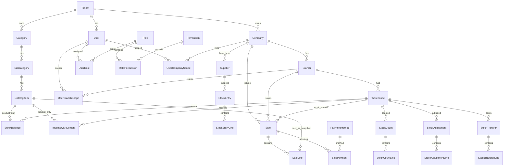

# ERD

El ERP conserva el modelo de datos avanzado del POS como base inicial. El schema fuente vive en:

```text
backend/prisma/schema.prisma
```

## Diagrama principal



## Restricciones recomendadas

- Indices compuestos por `tenantId` y claves de busqueda frecuentes.
- Unicidad por tenant para codigos internos relevantes.
- `StockBalance` unico por tenant, bodega y producto.
- `idempotencyKey` unica por tenant en movimientos criticos.
- Validaciones de tenant coherente entre entidades relacionadas.
